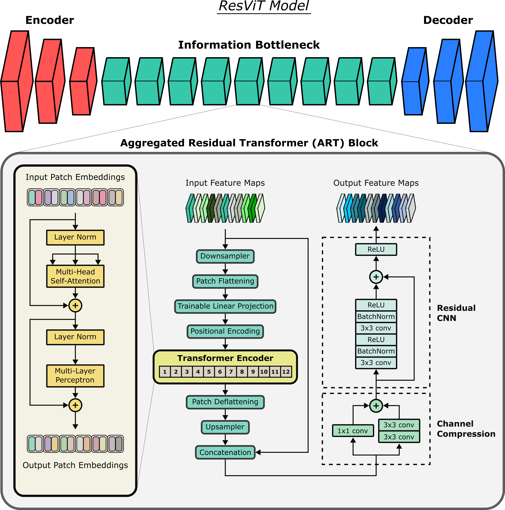

# ResViT
Official Pytorch Implementation of Residual Vision Transformers(ResViT) which is described in the [following](https://ieeexplore.ieee.org/document/9758823) paper:

O. Dalmaz, M. Yurt and T. Çukur, "ResViT: Residual Vision Transformers for Multimodal Medical Image Synthesis," in IEEE Transactions on Medical Imaging, vol. 41, no. 10, pp. 2598-2614, Oct. 2022, doi: 10.1109/TMI.2022.3167808.



## 环境搭建

0、python 3.8

1、安装pytorch，使用pytorch==1.12.0 cuda=10.2 这个配置，安装命令见官网

2、通过以下命令安装相应的python库
```
pip install scikit-image -i https://pypi.tuna.tsinghua.edu.cn/simple
pip install h5py -i https://pypi.tuna.tsinghua.edu.cn/simple
pip install ml_collections -i https://pypi.tuna.tsinghua.edu.cn/simple
pip install visdom -i https://pypi.tuna.tsinghua.edu.cn/simple
```

3、直接cd到文件夹中
```bash
cd ResViT
```

4、下载预训练权重
* [Pre-trained ViT models](https://console.cloud.google.com/storage/vit_models/):
```bash
wget https://storage.googleapis.com/vit_models/imagenet21k/R50+ViT-B_16.npz
```
**这个预训练权重的路径需要在ResViT/models/transformer_configs.py中的第29行修改，替换成自己的路径**

## 数据集准备
0、准备BRATS_PED数据集，主要是两个文件夹

注意：BRATS_PED只公开了训练集和验证集，因此这里将训练集按8:2重新划分为训练集和验证集，原本的验证集作为测试集

每个MRI图像只选取100个横截面作为训练数据，与论文保持一致
```
/Datasets/BRATS/
  ├──ASNR-MICCAI-BraTS2023-PED-Challenge-TrainingData
  ├──ASNR-MICCAI-BraTS2023-PED-Challenge-ValidationData
```
1、运行prepare_dataset.py文件, data_root为存放数据集的路径
```bash
python prepare_dataset.py --data_root /Datasets/BRATS/
```
最终会在/Datasets/BRATS/生成如下文件夹
```
/Datasets/BRATS/
  ├──ASNR-MICCAI-BraTS2023-PED-Challenge-TrainingData
  ├──ASNR-MICCAI-BraTS2023-PED-Challenge-ValidationData
  ├── FLAIR_T2
  ├── T2_FLAIR
  .
  .
  ├── T1_FLAIR_T2   
```
主要含义如下：

T2_FLAIR 对应 从T2生成FLAIR的one to one task

FLAIR_T2 对应 从FLAIR生成T2的one to one task

T1_FLAIR_T2 对应 从T1和FLAIR多个模态共同生成T2的many to one task

...

## 训练流程

### 对于 one to one 任务
这里展示通过T2转换成FLAIR的训练过程，FLAIR转换成T2的同理

0、先进行预训练, 运行如下代码：
```bash
CUDA_VISIBLE_DEVICES=6 python3 train.py --dataroot ../../dataset/PED/T1_T1CE/ --name T1_T1CE_pre_trained --gpu_ids 0 --model resvit_one \
      --which_model_netG res_cnn  --which_direction AtoB --lambda_A 100 --dataset_mode aligned --norm batch \
      --pool_size 0 --output_nc 1 --input_nc 1 --loadSize 256 --fineSize 256  --niter 50 --niter_decay 50 \
      --save_epoch_freq 5 --checkpoints_dir ckpt/PED --display_id 0 --lr 0.0002

CUDA_VISIBLE_DEVICES=5 python3 train.py --dataroot ../../dataset/BRATS2017/T1_T1CE/ --name BRATS2017_T1_T1CE_pre_trained --gpu_ids 0 --model resvit_one \
      --which_model_netG res_cnn  --which_direction AtoB --lambda_A 100 --dataset_mode aligned --norm batch \
      --pool_size 0 --output_nc 1 --input_nc 1 --loadSize 256 --fineSize 256  --niter 50 --niter_decay 50 \
      --save_epoch_freq 5 --checkpoints_dir ckpt/BRATS2017 --display_id 0 --lr 0.0002

CUDA_VISIBLE_DEVICES=5 python3 train.py --dataroot ../../dataset/TCGA_LGG_GBM/T1_T1CE/ --name TCGA_LGG_GBM_T1_T1CE_pre_trained --gpu_ids 0 --model resvit_one \
      --which_model_netG res_cnn  --which_direction AtoB --lambda_A 100 --dataset_mode aligned --norm batch \
      --pool_size 0 --output_nc 1 --input_nc 1 --loadSize 256 --fineSize 256  --niter 50 --niter_decay 50 \
      --save_epoch_freq 5 --checkpoints_dir ckpt/TCGA_LGG_GBM --display_id 0 --lr 0.0002

```
注意：其中的dataroot和checkpoints_dir都要替换成自己的路径

参数含义：

```
dataroot: 存放数据的路径，由第二部分数据集准备生成，对应的不同文件夹对应不同的转换关系
name: 保存的模型文件夹的名称
gpu_ids: 使用指定的GPU id
model: 使用的迁移模型，默认即可，不用修改
which_model_netG: 使用的生成器模型，默认即可，不用修改
which_direction: AtoB 指使用T2生成FLAIR, BtoA 指使用FLAIR生成T2,建议统一使用AtoB,修改dataroot来改变任务即可
lambda_A: cycle loss 权重大小，可作为超参数之一进行调整
dataset_mode: 指是否是匹配的生成模式，默认即可，不用修改
output_nc, input_nc: 默认即可，不用修改
loadSize: 输入的图片大小
fineSize: 生成的图片大小
checkpoints_dir: 模型保存路径，需要修改成自己的路径
save_epoch_freq: 保存模型的频率
lr: 学习率大小，可作为超参数之一进行调整
其余默认即可，不用修改
```
这一步训练后，会在checkpoints_dir路径下保存好预训练的模型latest_net_G.pth, 用于下一步的微调

训练生成的文件（checkpoints_dir路径）:
```
web 文件夹: 存放训练过程中的生成数据样本对，可以根据里面的图片观察训练的效果，打开html即可
log.txt: 训练log文件
loss_log.txt: 详细的训练过程中的loss数据
opt.txt: 参数变量定义
latest_net_G.pth, latest_net_D.pth: 最终的训练模型
```

1、微调训练, 运行如下代码：
```bash
CUDA_VISIBLE_DEVICES=6 python3 train.py --dataroot ../../dataset/PED/T1_T1CE/ --name T1_T1CE_pre_trained --gpu_ids 0 --model resvit_one \
      --which_model_netG resvit --which_direction AtoB --lambda_A 100 --dataset_mode aligned --norm batch --pool_size 0 \
      --output_nc 1 --input_nc 1 --loadSize 256 --fineSize 256 --niter 25 --niter_decay 25 --save_epoch_freq 5 \
      --checkpoints_dir ckpt/PED/finetune/ --display_id 0 --pre_trained_transformer 1 --pre_trained_resnet 1 \
      --pre_trained_path ckpt/PED/T1_T1CE_pre_trained/latest_net_G.pth --lr 0.001

CUDA_VISIBLE_DEVICES=5 python3 train.py --dataroot ../../dataset/BRATS2017/T1_T1CE/ --name BRATS2017_T1_T1CE_pre_trained --gpu_ids 0 --model resvit_one \
      --which_model_netG resvit --which_direction AtoB --lambda_A 100 --dataset_mode aligned --norm batch --pool_size 0 \
      --output_nc 1 --input_nc 1 --loadSize 256 --fineSize 256 --niter 25 --niter_decay 25 --save_epoch_freq 5 \
      --checkpoints_dir ckpt/BRATS2017/finetune/ --display_id 0 --pre_trained_transformer 1 --pre_trained_resnet 1 \
      --pre_trained_path ckpt/BRATS2017/BRATS2017_T1_T1CE_pre_trained/latest_net_G.pth --lr 0.001

```
注意：其中的dataroot和checkpoints_dir都要替换成自己的路径，pre_trained_path的参数替换成上一步生成的latest_net_G.pth的路径

这一步训练后，会在checkpoints_dir路径下保存好最终的模型latest_net_G.pth和latest_net_D.pth


### 对于 many to one 任务
这里展示通过T1, FLAIR转换成T2的训练过程，其余的同理

0、先进行预训练, 运行如下代码：
```bash
python3 train.py --dataroot /Datasets/BRATS/T1_FLAIR_T2/ --name T1_FLAIR_T2_pre_trained --gpu_ids 0 --model resvit_many \
      --which_model_netG res_cnn  --which_direction AtoB --lambda_A 100 --dataset_mode aligned --norm batch --pool_size 0 \
      --output_nc 1 --input_nc 3 --loadSize 256 --fineSize 256 --niter 50 --niter_decay 50 --save_epoch_freq 5 \
      --checkpoints_dir /Datasets/BRATS/checkpoints/ --display_id 0 --lr 0.0002
```
注意：其中的dataroot和checkpoints_dir都要替换成自己的路径

参数含义与上述的是一样的

1、微调训练，运行如下代码:
```bash
python3 train.py --dataroot /Datasets/BRATS/T1_FLAIR_T2/ --name T1_FLAIR_T2_resvit --gpu_ids 0 --model resvit_many \
    --which_model_netG resvit --which_direction AtoB --lambda_A 100 --dataset_mode aligned --norm batch --pool_size 0 \
    --output_nc 1 --input_nc 3 --loadSize 256 --fineSize 256 --niter 25 --niter_decay 25 --save_epoch_freq 5 \
    --checkpoints_dir /Datasets/BRATS/checkpoints/ --display_id 0 --pre_trained_transformer 1 --pre_trained_resnet 1 \
    --pre_trained_path /Datasets/BRATS/checkpoints/T1_FLAIR_T2_pre_trained/latest_net_G.pth --lr 0.001
```
注意：其中的dataroot和checkpoints_dir都要替换成自己的路径，pre_trained_path的参数替换成上一步生成的latest_net_G.pth的路径

这一步训练后，会在checkpoints_dir路径下保存好最终的模型latest_net_G.pth和latest_net_D.pth

## 测试流程

### 对于 one to one 任务
0、定性测试，运行如下命令:
```bash
CUDA_VISIBLE_DEVICES=4 python3 test.py --dataroot ../../dataset/PED/T1_T1CE/ --name T1_T1CE_pre_trained --gpu_ids 0 --model resvit_one --which_model_netG resvit \
        --dataset_mode aligned --norm batch --phase test --output_nc 1 --input_nc 1 --how_many 10000 --serial_batches \
        --fineSize 256 --loadSize 256 --results_dir ckpt/PED/finetune/ \
        --checkpoints_dir ckpt/PED/finetune/ --which_epoch latest

CUDA_VISIBLE_DEVICES=7 python3 test.py --dataroot ../../dataset/BRATS2017/T1_T1CE/ --name T1_T1CE_pre_trained --gpu_ids 0 --model resvit_one --which_model_netG resvit \
        --dataset_mode aligned --norm batch --phase test --output_nc 1 --input_nc 1 --how_many 10000 --serial_batches \
        --fineSize 256 --loadSize 256 --results_dir ckpt/BRATS2017/finetune/ \
        --checkpoints_dir ckpt/BRATS2017/finetune/ --which_epoch latest

```
注意：其中的dataroot和checkpoints_dir都要替换成自己的路径, --results_dir 表示结果保存路径, 其余参数与上述一致

最终可视化结果保存在results_dir路径中

1、定量测试，运行如下命令：
    
计算SSIM和PSNR:
```bash
CUDA_VISIBLE_DEVICES=4 python test/test_SSIM.py --fold_test ckpt/PED/finetune/T1_T1CE_pre_trained/test_latest/images/
CUDA_VISIBLE_DEVICES=4 python test/test_SSIM.py --fold_test ckpt/BRATS2017/finetune/T1_T1CE_pre_trained/test_latest/images/
CUDA_VISIBLE_DEVICES=4 python test/test_SSIM.py --fold_test 
```

计算FID:
```bash
python test/test_FID.py --fold_test /Datasets/BRATS/checkpoints/T2_FLAIR_resvit/results/T2_FLAIR_resvit/test_latest/images/
```

### 对于 many to one 任务
0、定性测试，运行如下命令:
```bash
python3 test.py --dataroot /Datasets/BRATS/T1_FLAIR_T2/ --name T1_FLAIR_T2_resvit --gpu_ids 0 --model resvit_many --which_model_netG resvit \
      --dataset_mode aligned --norm batch --phase test --output_nc 1 --input_nc 3 --how_many 10000 \
      --serial_batches --fineSize 256 --loadSize 256 --results_dir /Datasets/BRATS/checkpoints/T1_FLAIR_T2_resvit/results/ \
      --checkpoints_dir /Datasets/BRATS/checkpoints/ --which_epoch latest
```
注意：其中的dataroot和checkpoints_dir都要替换成自己的路径, --results_dir 表示结果保存路径, 其余参数与上述一致

最终可视化结果保存在results_dir路径中

1、定量测试，运行如下命令：

计算SSIM和PSNR:
```bash
python test/test_SSIM.py --fold_test /Datasets/BRATS/checkpoints/T1_FLAIR_T2_resvit/results/T1_FLAIR_T2_resvit/test_latest/images/
```

计算FID:
```bash
python test/test_FID.py --fold_test /Datasets/BRATS/checkpoints/T1_FLAIR_T2_resvit/results/T1_FLAIR_T2_resvit/test_latest/images/
```